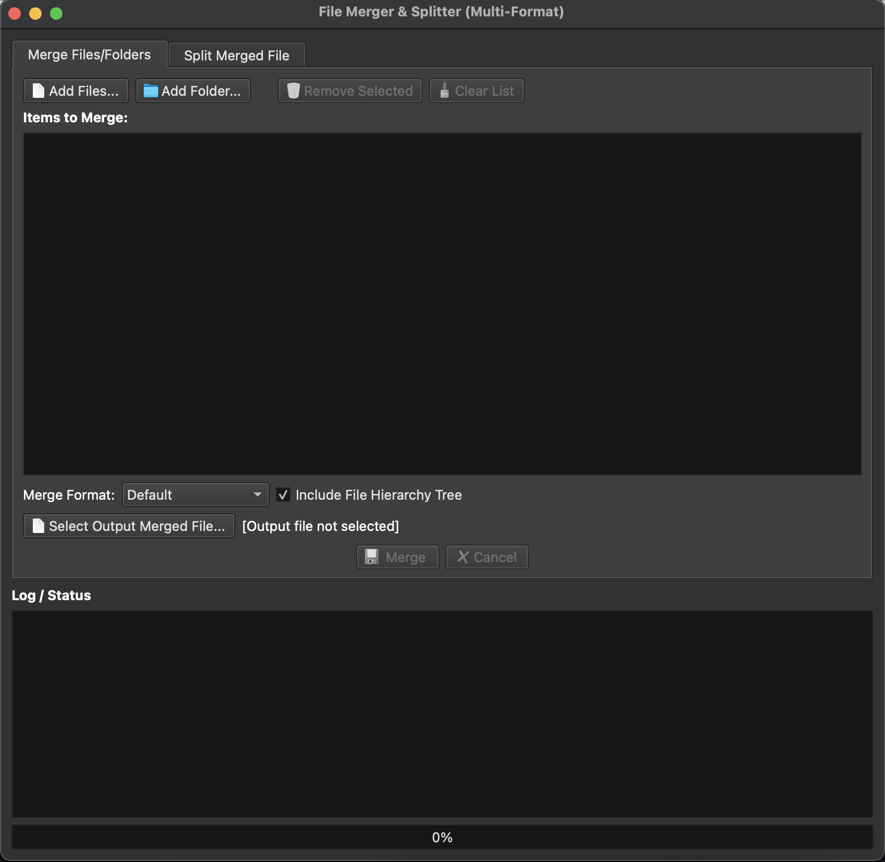

# File Merger & Splitter




A graphical desktop utility (built with Python and PyQt6) to easily merge multiple files and entire directory structures into a single text file, and later split that merged file back into its original components.

This tool is particularly useful for consolidating entire software projects or collections of documents into a single context file, making it easier to provide comprehensive context to Large Language Models (LLMs) like ChatGPT, Claude, Gemini, Llama, etc.

## Why Use This for LLMs?

Large Language Models often have context window limits and providing code or documents file-by-file can be incredibly time-consuming and prone to missing information. Manually copying and pasting the content of dozens or hundreds of files is tedious work.

**File Merger & Splitter solves this by:**

1.  **Consolidating Context:** It automatically traverses selected folders and files, merging their content into *one* structured text file.
2.  **Preserving Structure:** It includes delimiters clearly marking the start and end of each original file, including its relative path. This helps the LLM understand the project's organization.
3.  **Saving Time:** Automates the process of gathering all necessary code/text, freeing you up to focus on interacting with the LLM.
4.  **Providing Completeness:** Ensures you provide the LLM with the *entire* relevant context, not just snippets, leading to potentially better analysis, code generation, or understanding.
5.  **Optional Hierarchy Tree:** Can optionally prepend a visual tree structure of all included files to the merged output, giving the LLM (or a human reader) an immediate overview of the project layout.

Simply merge your project, copy the content of the resulting `merged_output.txt` (or similar), and paste it into your LLM prompt!

## Features

*   **Graphical User Interface:** Easy-to-use interface built with PyQt6.
*   **Merge Files:** Select individual files to merge.
*   **Merge Folders:** Select entire folders; the tool scans recursively.
*   **Selective Folder Merging:** Use the detailed tree view dialog to precisely check/uncheck sub-folders and files within a selected folder.
*   **Multiple Merge Formats:** Choose from different delimiter styles (see below).
*   **Split Merged Files:** Recreate the original directory structure and files from a previously merged file (requires using the same format for merging and splitting).
*   **File Hierarchy Tree:** Option to include a textual representation of the file structure at the beginning of the merged file.
*   **Background Processing:** Uses QThreads to perform merging/splitting without freezing the UI.
*   **Progress Bar & Logging:** Provides feedback on the operation status.
*   **Cross-Platform:** Should work on Windows, macOS, and Linux (wherever Python and PyQt6 are supported).
*   **Dark Theme:** Uses the Fusion style for better compatibility with dark system themes.

## Usage

### Merging Files/Folders

1.  Open the application. It defaults to the "Merge Files/Folders" tab.
2.  Click **"Add Files..."** to select one or more individual files.
3.  Click **"Add Folder..."** to select a directory.
    *   A dialog will appear showing the folder's contents in a tree view.
    *   Check/uncheck files and subfolders you want to include. Use the tri-state checkboxes for folders (checked=all children, partial=some children, unchecked=no children).
    *   Click **OK**. A single entry representing the folder selection appears in the main list.
4.  Items added appear in the "Items to Merge" list view. You can select items in this list and click **"Remove Selected"** or **"Clear List"**.
5.  Choose the desired **"Merge Format"** from the dropdown (e.g., "Default", "Markdown").
6.  Check or uncheck **"Include File Hierarchy Tree"** based on your preference.
7.  Click **"Select Output Merged File..."** and choose where to save the combined file (e.g., `merged_output.txt`).
8.  Click the **"Merge"** button.
9.  Wait for the progress bar and log to indicate completion.

### Splitting a Merged File

1.  Go to the "Split Merged File" tab.
2.  Click **"Select Merged File to Split..."** and choose the `.txt` file you created during the merge step.
3.  Click **"Select Output Folder..."** and choose an **existing or new empty directory** where the original files and folders will be recreated.
4.  Select the **"Split Format"** from the dropdown. **Crucially, this must match the format used when the file was merged.**
5.  Click the **"Split"** button.
6.  Wait for the progress bar and log to indicate completion. The original file structure will be recreated in the selected output folder.

## Building from Source

If you want to run or build the application yourself:

**Prerequisites:**

*   Python 3.8 or newer
*   `pip` (Python package installer)

**Steps:**

1.  **Clone the repository:**
    ```bash
    git clone <repository-url>
    cd file-merger-splitter
    ```
2.  **Create and activate a virtual environment (Recommended):**
    ```bash
    # On Windows
    python -m venv .venv
    .\.venv\Scripts\activate

    # On macOS/Linux
    python3 -m venv .venv
    source .venv/bin/activate
    ```
3.  **Install dependencies:**
    ```bash
    pip install -r requirements.txt
    ```
4.  **Run the application:**
    ```bash
    python main.py
    ```
5.  **Build an executable (Optional):**
    PyInstaller is used for building. The configuration is in `FileMergerSplitter.spec`.
    ```bash
    pyinstaller FileMergerSplitter.spec
    ```
    The executable (and necessary files/folders for distribution) will be located in the `dist` directory.

## Dependencies

*   [PyQt6](https://pypi.org/project/PyQt6/): The GUI toolkit.
*   [PyInstaller](https://pypi.org/project/PyInstaller/): Used for building the executable (listed in `requirements.txt` for convenience, but only needed for building).